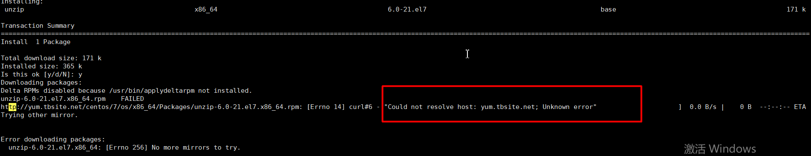

# Linux安装清华源

​	　Linux版本是`Red Hat 4.8.5-44`，在`10.10.144.6`服务器上执行`yum install unzip`提示如下错误：



​	　首先，修改DNS为如下地址，但是更改后，再次使用安装命令，仍然是报错。所以，需要更换Linux软件安装源才能解决问题。

```shell
vi /etc/resolve. conf
# 修改DNS
nameserver 100.100.2.136
nameserver 100.100.2.138
```


## 更换安装源

### 保存原有配置

​	　首先，将原有的`*.repo`配置全部移到新建的`bak`文件中。

```shell
cd /etc/yum.repos.d
# 保存原有的配置
mkdir bak
mv *.repo bak
```


### 新增清华源配置信息

​	　然后，新增清华源配置信息。

```shell
# 新建 CentOS-Base.repo
vi CentOS-Base.repo

# 输入清华源
[base]
name=CentOS-$releasever - Base
baseurl=https://mirrors.tuna.tsinghua.edu.cn/centos/$releasever/os/$basearch/
gpgcheck=1
gpgkey=file:///etc/pki/rpm-gpg/RPM-GPG-KEY-CentOS-7

#released updates
[updates]
name=CentOS-$releasever - Updates
baseurl=https://mirrors.tuna.tsinghua.edu.cn/centos/$releasever/updates/$basearch/
gpgcheck=1
gpgkey=file:///etc/pki/rpm-gpg/RPM-GPG-KEY-CentOS-7

#additional packages that may be useful
[extras]
name=CentOS-$releasever - Extras
baseurl=https://mirrors.tuna.tsinghua.edu.cn/centos/$releasever/extras/$basearch/
gpgcheck=1
gpgkey=file:///etc/pki/rpm-gpg/RPM-GPG-KEY-CentOS-7

#additional packages that extend functionality of existing packages
[centosplus]
name=CentOS-$releasever - Plus
baseurl=https://mirrors.tuna.tsinghua.edu.cn/centos/$releasever/centosplus/$basearch/
gpgcheck=1
enabled=0
gpgkey=file:///etc/pki/rpm-gpg/RPM-GPG-KEY-CentOS-7
```

### 新增配置生效

​	　执行如下两条命令，都成功后，才能成功安装`unzip`。

```shell
yum clean all
yum makecache
# 再次安装unzip
yum install unzip
```

