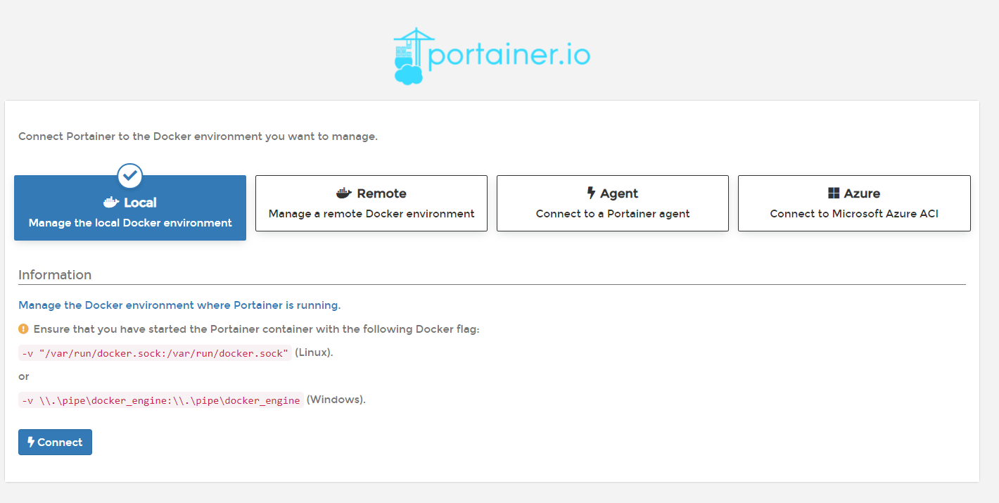

# Portainer

​	　Portainer是一个可视化的容器镜像的图形管理工具，利用Portainer可以轻松构建、管理和维护Docker环境。首先，通过如下命令拉取Portainer镜像。

```shell
# 查询portainer镜像
docker search portainer
# 拉取portainer镜像
docker pull portainer/portainer
```

​	　接着，配置中文环境（可选）。

```shell
# 下载中文语言包
git clone https://gitee.com/faith01238/Dockers.git 
cd Dockers/Portainer/
# 新建portainer目录
mkdir -p /home/docker/volume/portainer
# 复制语言包
cp -rf public/ /home/docker/volume/portainer
cd /home/docker/volume/portainer
```

​	　然后，运行portainer镜像。

```shell
# 创建数据卷
docker volume create portainer_data
# 运行portainer
docker run --name portainer -d \
-p 8000:8000 \
-p 9000:9000 \
-v /var/run/docker.sock:/var/run/docker.sock \
-v /home/docker/volume/portainer/data/:/data \
-v /home/docker/volume/portainer/public/:/public \
portainer/portainer
```

​	　打开 [http://172.16.205.117:9000/](http://172.16.205.117:9000/)，第一次进入需要设置管理员密码，设置完成后，`Connect`本地或者远程的Docker进行可视化管理。



