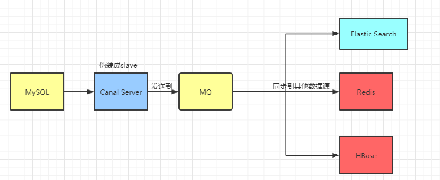

# 使用Alibaba canal同步数据库

​    　`canal`是阿里开源的一个中间件，基于监听`binlog`日志去进行同步数据，用于 **MySQL 数据库增量日志解析**，提供**增量数据订阅和消费**。对业务代码没有侵入、具有实时性。

​    　canal有一个server工程，该server自己伪装为MySQL的一个slave节点，模拟MySQL slave的交互协议向MySQL Mater发送 dump协议。MySQL mater收到canal发送过来的dump请求，开始推送`binlog`给canal，然后canal解析binlog，再发送到存储目的地。



**参考资料：**

- [GitHub](https://github.com/alibaba/canal)
- [Canal详细入门实战](https://www.1024sky.cn/blog/article/52984)

## 生产者

### Mysql Start

​    　首先，查看MySql是否已经启用了`binlog`模式，显示 `ON` 表示开启。

```sql
mysql> show variables like 'log_bin';
+---------------+-------+
| Variable_name | Value |
+---------------+-------+
| log_bin       | ON    |
+---------------+-------+
mysql> show variables like 'binlog_format';
+---------------+-------+
| Variable_name | Value |
+---------------+-------+
| binlog_format | ROW   |
+---------------+-------+
```

​    　若未开启`binlog`模式，需要修改MySQL配置文件`my.cnf`，然后重启数据库，并查看配置是否生效

```properties
[mysqld]
# 打开binlog
log-bin=mysql-bin
# 选择ROW(行)模式
binlog-format=ROW
# 配置MySQL replaction需要定义，不要和canal的slaveId重复
server_id=1
```

​    　配置生效后，接着，授权 `canal` 链接 MySQL 账号具有作为 MySQL slave 的权限, 如果已有账户可直接 `grant`。

```sql
-- 使用命令登录：mysql -u root -p
-- 创建mysql用户 用户名：canal 密码：canal
CREATE USER canal IDENTIFIED BY 'canal';  
-- 给新建的用户赋权
GRANT SELECT, REPLICATION SLAVE, REPLICATION CLIENT ON *.* TO 'canal'@'%';
-- GRANT ALL PRIVILEGES ON *.* TO 'canal'@'%' ;
FLUSH PRIVILEGES;
```

### Canal Server

​    　首先，在配置文件`instance.properties`中，配置MySQL数据库相关信息。

```properties
# mysql serverId , v1.0.26+ will autoGen
# canal.instance.mysql.slaveId=0

# Mysql地址和端口
canal.instance.master.address=数据库IP:3306

# 数据库账号密码，可以使用root账号或刚创建的canal账号
canal.instance.dbUsername=数据库用户名
canal.instance.dbPassword=数据库密码
canal.instance.defaultDatabaseName =数据库名
canal.instance.connectionCharset = UTF-8

# 配置监听，支持正则表达式
# regex .*\\..* 表示监听所有表 也可以写具体的表名，用，隔开
canal.instance.filter.regex=.*\\..*
# 配置不监听，支持正则表达式
canal.instance.filter.black.regex=mysql\\.slave_.*
```

​    　然后，在配置文件`canal.properties`中，配置`canal-deployer`信息。

```properties
# canal-deployer的ip地址，不配置默认是本机
canal.ip = 127.0.0.1
# canal-deployer的端口号
canal.port = 11111

# 设置用户名密码
# canal.user = canal
# canal.passwd = E3619321C1A937C46A0D8BD1DAC39F93B27D4458

# 服务协议
canal.serverMode = tcp
# 加载多个配置文件，需在conf下创建对应的文件夹，并加上instance.properties配置文件
canal.destinations = example
# 配置多个使用英文逗号隔开
# canal.destinations = example,example2
```

​    　接下来，编辑`docker-compose.yml`配置文件。

```yaml
version: '3.1'
services:
  tomcat:
    restart: always
    image: canal/canal-server
    container_name: canal-server
    ports:
      - 11111:11111
    volumes:
      - ./instance.properties:/home/admin/canal-server/conf/example/instance.properties
      - ./canal.properties:/home/admin/canal-server/conf/canal.properties
      - ./logs/:/home/admin/canal-server/logs/
    environment:
      TZ: Asia/Shanghai
```

​    　执行`docker-compsoe up -d`命令启动`canal-server`，并查看`logs目录`下的`example/example.log`日志文件是否已经打印出了数据库链接成功信息。

## 消费者

### SpringBoot

​    　在服务器上新建如下部署目录结构，其中，`instance.propertie`和`canal.properties`的初始配置文件，请参照目录 或者 [这里](https://github.com/alibaba/canal/releases)。

```shell
# 部署目录
alibaba-canal
------canal-server
---------instance.properties    # 数据库实例配置文件
---------canal.properties       # 监听程序链接配置文件
---------docker-compose.yml
---------log
------------canal               # 监控程序链接日志
------------example             # 数据库链接日志

------canal-deployer
---------alibaba-canal-0.0.1.jar
---------docker-compose.yml
---------Dockerfile
```

​    　然后，新建SpringBoot项目监听`canal-deployer`，首先，添加`canal`依赖到`pom.xml`。

```xml
<dependency>
    <groupId>com.alibaba.otter</groupId>
    <artifactId>canal.client</artifactId>
    <version>1.1.4</version>
</dependency>
```

​    　然后，新建`CanalClient`类实现`InitializingBean`，以便在初始化时运行。

```java
package com.shooter.springboot.alibabacanal.develop;

import java.net.InetSocketAddress;
import java.util.List;
import com.alibaba.otter.canal.client.CanalConnectors;
import com.alibaba.otter.canal.client.CanalConnector;
import com.alibaba.otter.canal.protocol.Message;
import com.alibaba.otter.canal.protocol.CanalEntry.Column;
import com.alibaba.otter.canal.protocol.CanalEntry.Entry;
import com.alibaba.otter.canal.protocol.CanalEntry.EntryType;
import com.alibaba.otter.canal.protocol.CanalEntry.EventType;
import com.alibaba.otter.canal.protocol.CanalEntry.RowChange;
import com.alibaba.otter.canal.protocol.CanalEntry.RowData;
import org.springframework.beans.factory.InitializingBean;
import org.springframework.stereotype.Component;


@Component
public class CanalClient implements InitializingBean {

    private final static int BATCH_SIZE = 1000;

    @Override
    public void afterPropertiesSet() throws Exception {
        // 创建链接
        CanalConnector connector = CanalConnectors.newSingleConnector(
                new InetSocketAddress("127.0.0.1", 11111), "example", "", "");
        try {
            //打开连接
            connector.connect();
            //订阅数据库表,全部表
            connector.subscribe(".*\\..*");
            //回滚到未进行ack的地方，下次fetch的时候，可以从最后一个没有ack的地方开始拿
            connector.rollback();
            while (true) {
                // 获取指定数量的数据
                Message message = connector.getWithoutAck(BATCH_SIZE);
                //获取批量ID
                long batchId = message.getId();
                //获取批量的数量
                int size = message.getEntries().size();
                //如果没有数据
                if (batchId == -1 || size == 0) {
                    try {
                        //线程休眠2秒
                        Thread.sleep(2000);
                    } catch (InterruptedException e) {
                        e.printStackTrace();
                    }
                } else {
                    //如果有数据,处理数据
                    printEntry(message.getEntries());
                }
                //进行 batch id 的确认。确认之后，小于等于此 batchId 的 Message 都会被确认。
                connector.ack(batchId);
            }
        } catch (Exception e) {
            e.printStackTrace();
        } finally {
            connector.disconnect();
        }
    }

    /**
     * 打印canal server解析binlog获得的实体类信息
     */
    private static void printEntry(List<Entry> entrys) {
        for (Entry entry : entrys) {
            if (entry.getEntryType() == EntryType.TRANSACTIONBEGIN || entry.getEntryType() == EntryType.TRANSACTIONEND) {
                //开启/关闭事务的实体类型，跳过
                continue;
            }
            //RowChange对象，包含了一行数据变化的所有特征
            //比如isDdl 是否是ddl变更操作 sql 具体的ddl sql beforeColumns afterColumns 变更前后的数据字段等等
            RowChange rowChage;
            try {
                rowChage = RowChange.parseFrom(entry.getStoreValue());
            } catch (Exception e) {
                throw new RuntimeException("ERROR ## parser of eromanga-event has an error , data:" + entry.toString(), e);
            }
            //获取操作类型：insert/update/delete类型
            EventType eventType = rowChage.getEventType();
            //打印Header信息
            System.out.println(String.format("================》; binlog[%s:%s] , name[%s,%s] , eventType : %s",
                    entry.getHeader().getLogfileName(), entry.getHeader().getLogfileOffset(),
                    entry.getHeader().getSchemaName(), entry.getHeader().getTableName(),
                    eventType));
            //判断是否是DDL语句
            if (rowChage.getIsDdl()) {
                System.out.println("================》;isDdl: true,sql:" + rowChage.getSql());
            }
            //获取RowChange对象里的每一行数据，打印出来
            for (RowData rowData : rowChage.getRowDatasList()) {
                //如果是删除语句
                if (eventType == EventType.DELETE) {
                    printColumn(rowData.getBeforeColumnsList());
                    //如果是新增语句
                } else if (eventType == EventType.INSERT) {
                    printColumn(rowData.getAfterColumnsList());
                    //如果是更新的语句
                } else {
                    //变更前的数据
                    System.out.println("------->; before");
                    printColumn(rowData.getBeforeColumnsList());
                    //变更后的数据
                    System.out.println("------->; after");
                    printColumn(rowData.getAfterColumnsList());
                }
            }
        }
    }

    private static void printColumn(List<Column> columns) {
        for (Column column : columns) {
            System.out.println(column.getName() + " : " + column.getValue() + "    update=" + column.getUpdated());
        }
    }
}
```

​    　并且需要在`application.yml`中设定启动端口为`8085`。

```
server:
  port: 8085
```

​    　接下来，将项目打包到远程服务器，并编写`Dockerfile`文件。

```dockerfile
FROM openjdk:8
WORKDIR /app
COPY alibaba-canal-0.0.1.jar .
ENTRYPOINT ["java", "-jar", "alibaba-canal-0.0.1.jar"]
EXPOSE 8085
```

​    　继续编写`docker-compose.yml`启动配置文件。

```yaml
version: '3.1'
services:
  canal-boot:
    restart: always
    build: .
    container_name: synData
    ports:
      - 8085:8085
    environment:
      TZ: Asia/Shanghai
```

​    　执行`docker-compose up -d`命令，启动项目，然后`docker logs -f synData`即可查看到数据库正在执行语句。注意，`canal-server`一定是要访问到`springboot`项目才行哦！

## 附录

### instance.properties

```properties
#################################################
## mysql serverId , v1.0.26+ will autoGen
# canal.instance.mysql.slaveId=0

# enable gtid use true/false
canal.instance.gtidon=false

# position info
canal.instance.master.address=127.0.0.1:3306
canal.instance.master.journal.name=
canal.instance.master.position=
canal.instance.master.timestamp=
canal.instance.master.gtid=

# rds oss binlog
canal.instance.rds.accesskey=
canal.instance.rds.secretkey=
canal.instance.rds.instanceId=

# table meta tsdb info
canal.instance.tsdb.enable=true
#canal.instance.tsdb.url=jdbc:mysql://127.0.0.1:3306/canal_tsdb
#canal.instance.tsdb.dbUsername=canal
#canal.instance.tsdb.dbPassword=canal

#canal.instance.standby.address =
#canal.instance.standby.journal.name =
#canal.instance.standby.position =
#canal.instance.standby.timestamp =
#canal.instance.standby.gtid=

# username/password
canal.instance.dbUsername=canal
canal.instance.dbPassword=canal
canal.instance.connectionCharset = UTF-8
# enable druid Decrypt database password
canal.instance.enableDruid=false
#canal.instance.pwdPublicKey=MFwwDQYJKoZIhvcNAQEBBQADSwAwSAJBALK4BUxdDltRRE5/zXpVEVPUgunvscYFtEip3pmLlhrWpacX7y7GCMo2/JM6LeHmiiNdH1FWgGCpUfircSwlWKUCAwEAAQ==

# table regex
canal.instance.filter.regex=.*\\..*
# table black regex
canal.instance.filter.black.regex=mysql\\.slave_.*
# table field filter(format: schema1.tableName1:field1/field2,schema2.tableName2:field1/field2)
#canal.instance.filter.field=test1.t_product:id/subject/keywords,test2.t_company:id/name/contact/ch
# table field black filter(format: schema1.tableName1:field1/field2,schema2.tableName2:field1/field2)
#canal.instance.filter.black.field=test1.t_product:subject/product_image,test2.t_company:id/name/contact/ch

# mq config
canal.mq.topic=example
# dynamic topic route by schema or table regex
#canal.mq.dynamicTopic=mytest1.user,mytest2\\..*,.*\\..*
canal.mq.partition=0
# hash partition config
#canal.mq.partitionsNum=3
#canal.mq.partitionHash=test.table:id^name,.*\\..*
#canal.mq.dynamicTopicPartitionNum=test.*:4,mycanal:6
#################################################
```

### canal.properties

```properties
#################################################
#########         common argument        #############
#################################################
# tcp bind ip
canal.ip =
# register ip to zookeeper
canal.register.ip =
canal.port = 11111
canal.metrics.pull.port = 11112
# canal instance user/passwd
# canal.user = canal
# canal.passwd = E3619321C1A937C46A0D8BD1DAC39F93B27D4458

# canal admin config
#canal.admin.manager = 127.0.0.1:8089
canal.admin.port = 11110
canal.admin.user = admin
canal.admin.passwd = 4ACFE3202A5FF5CF467898FC58AAB1D615029441
# admin auto register
#canal.admin.register.auto = true
#canal.admin.register.cluster =
#canal.admin.register.name =

canal.zkServers =
# flush data to zk
canal.zookeeper.flush.period = 1000
canal.withoutNetty = false
# tcp, kafka, rocketMQ, rabbitMQ
canal.serverMode = tcp
# flush meta cursor/parse position to file
canal.file.data.dir = ${canal.conf.dir}
canal.file.flush.period = 1000
## memory store RingBuffer size, should be Math.pow(2,n)
canal.instance.memory.buffer.size = 16384
## memory store RingBuffer used memory unit size , default 1kb
canal.instance.memory.buffer.memunit = 1024 
## meory store gets mode used MEMSIZE or ITEMSIZE
canal.instance.memory.batch.mode = MEMSIZE
canal.instance.memory.rawEntry = true

## detecing config
canal.instance.detecting.enable = false
#canal.instance.detecting.sql = insert into retl.xdual values(1,now()) on duplicate key update x=now()
canal.instance.detecting.sql = select 1
canal.instance.detecting.interval.time = 3
canal.instance.detecting.retry.threshold = 3
canal.instance.detecting.heartbeatHaEnable = false

# support maximum transaction size, more than the size of the transaction will be cut into multiple transactions delivery
canal.instance.transaction.size =  1024
# mysql fallback connected to new master should fallback times
canal.instance.fallbackIntervalInSeconds = 60

# network config
canal.instance.network.receiveBufferSize = 16384
canal.instance.network.sendBufferSize = 16384
canal.instance.network.soTimeout = 30

# binlog filter config
canal.instance.filter.druid.ddl = true
canal.instance.filter.query.dcl = false
canal.instance.filter.query.dml = false
canal.instance.filter.query.ddl = false
canal.instance.filter.table.error = false
canal.instance.filter.rows = false
canal.instance.filter.transaction.entry = false
canal.instance.filter.dml.insert = false
canal.instance.filter.dml.update = false
canal.instance.filter.dml.delete = false

# binlog format/image check
canal.instance.binlog.format = ROW,STATEMENT,MIXED 
canal.instance.binlog.image = FULL,MINIMAL,NOBLOB

# binlog ddl isolation
canal.instance.get.ddl.isolation = false

# parallel parser config
canal.instance.parser.parallel = true
## concurrent thread number, default 60% available processors, suggest not to exceed Runtime.getRuntime().availableProcessors()
#canal.instance.parser.parallelThreadSize = 16
## disruptor ringbuffer size, must be power of 2
canal.instance.parser.parallelBufferSize = 256

# table meta tsdb info
canal.instance.tsdb.enable = true
canal.instance.tsdb.dir = ${canal.file.data.dir:../conf}/${canal.instance.destination:}
canal.instance.tsdb.url = jdbc:h2:${canal.instance.tsdb.dir}/h2;CACHE_SIZE=1000;MODE=MYSQL;
canal.instance.tsdb.dbUsername = canal
canal.instance.tsdb.dbPassword = canal
# dump snapshot interval, default 24 hour
canal.instance.tsdb.snapshot.interval = 24
# purge snapshot expire , default 360 hour(15 days)
canal.instance.tsdb.snapshot.expire = 360

#################################################
#########         destinations        #############
#################################################
canal.destinations = example
# conf root dir
canal.conf.dir = ../conf
# auto scan instance dir add/remove and start/stop instance
canal.auto.scan = true
canal.auto.scan.interval = 5
# set this value to 'true' means that when binlog pos not found, skip to latest.
# WARN: pls keep 'false' in production env, or if you know what you want.
canal.auto.reset.latest.pos.mode = false

canal.instance.tsdb.spring.xml = classpath:spring/tsdb/h2-tsdb.xml
#canal.instance.tsdb.spring.xml = classpath:spring/tsdb/mysql-tsdb.xml

canal.instance.global.mode = spring
canal.instance.global.lazy = false
canal.instance.global.manager.address = ${canal.admin.manager}
#canal.instance.global.spring.xml = classpath:spring/memory-instance.xml
canal.instance.global.spring.xml = classpath:spring/file-instance.xml
#canal.instance.global.spring.xml = classpath:spring/default-instance.xml

##################################################
#########           MQ Properties      #############
##################################################
# aliyun ak/sk , support rds/mq
canal.aliyun.accessKey =
canal.aliyun.secretKey =
canal.aliyun.uid=

canal.mq.flatMessage = true
canal.mq.canalBatchSize = 50
canal.mq.canalGetTimeout = 100
# Set this value to "cloud", if you want open message trace feature in aliyun.
canal.mq.accessChannel = local

canal.mq.database.hash = true
canal.mq.send.thread.size = 30
canal.mq.build.thread.size = 8

##################################################
#########              Kafka              #############
##################################################
kafka.bootstrap.servers = 127.0.0.1:9092
kafka.acks = all
kafka.compression.type = none
kafka.batch.size = 16384
kafka.linger.ms = 1
kafka.max.request.size = 1048576
kafka.buffer.memory = 33554432
kafka.max.in.flight.requests.per.connection = 1
kafka.retries = 0

kafka.kerberos.enable = false
kafka.kerberos.krb5.file = "../conf/kerberos/krb5.conf"
kafka.kerberos.jaas.file = "../conf/kerberos/jaas.conf"

##################################################
#########             RocketMQ         #############
##################################################
rocketmq.producer.group = test
rocketmq.enable.message.trace = false
rocketmq.customized.trace.topic =
rocketmq.namespace =
rocketmq.namesrv.addr = 127.0.0.1:9876
rocketmq.retry.times.when.send.failed = 0
rocketmq.vip.channel.enabled = false
rocketmq.tag = 

##################################################
#########             RabbitMQ         #############
##################################################
rabbitmq.host =
rabbitmq.virtual.host =
rabbitmq.exchange =
rabbitmq.username =
rabbitmq.password =
rabbitmq.deliveryMode =
```

### 订阅数据库表

​    　可以在 `connector.subscribe` [`java`] 或者 `canal.instance.filter.regex` [`instance.properties`] 中设定设定监控表的范围。

```shell
# 所有库所有表
.*\\..*
# 指定库全表（库名\..*）
test\..*

# 单表（库名.表名）
test.user 

# 多规则组合使用
# 库名1\..*,库名2.表名1,库名3.表名2 (逗号分隔)
test\..*,test2.user1,test3.user2
```
