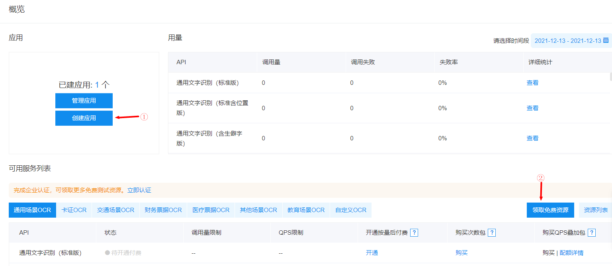
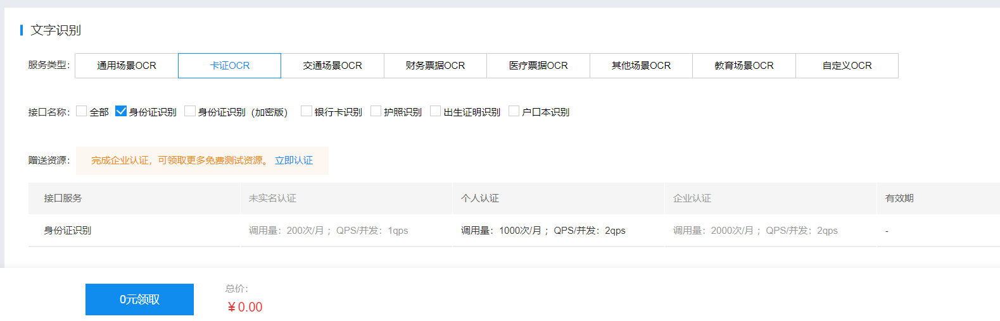
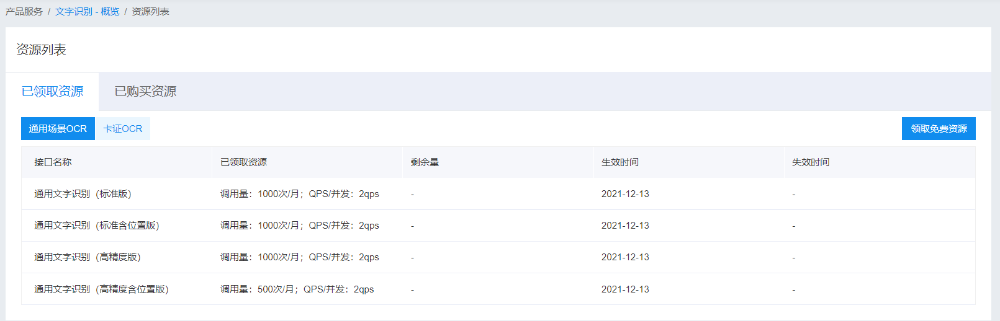

# 百度通用文字识别


**参考资料：**

- [功能演示](https://ai.baidu.com/tech/ocr_cards/business)
- [开发文档](https://ai.baidu.com/ai-doc/OCR/1k3h7y3db)


## 创建应用

​	　首先，[登录](https://login.bce.baidu.com/?account=)百度智能云，然后完成**实名认证**后，**创建应用**，并**领取免费的资源**。



​	　我们可以看到，百度智能云是提供了每月`1000`次的免费额度。



​	　稍等一会（可能是30分支左右），即可在已领取资源页面看到可用资源。



​	　至此，开发的前置条件已经准备完成了。


## 代码开发

### enums

```java
package com.shooter.common.baiduai.enums;

public enum UrlEnums {

    /**
     * 通用文字识别
     * */
    GENERAL_URL("https://aip.baidubce.com/rest/2.0/ocr/v1/general_basic","通用文字识别");

    private String value;

    private String desc;

    UrlEnums(String value,String desc) {
        this.value = value;
        this.desc = desc;
    }

    public String value() {
        return value;
    }

    public String desc() {
        return desc;
    }
}
```


### utils

（1）Base64 工具类

```java
package com.shooter.common.baiduai.utils;

/**
 * Base64 工具类
 */
public class Base64Util {
    private static final char last2byte = (char) Integer.parseInt("00000011", 2);
    private static final char last4byte = (char) Integer.parseInt("00001111", 2);
    private static final char last6byte = (char) Integer.parseInt("00111111", 2);
    private static final char lead6byte = (char) Integer.parseInt("11111100", 2);
    private static final char lead4byte = (char) Integer.parseInt("11110000", 2);
    private static final char lead2byte = (char) Integer.parseInt("11000000", 2);
    private static final char[] encodeTable = new char[]{'A', 'B', 'C', 'D', 'E', 'F', 'G', 'H', 'I', 'J', 'K', 'L', 'M', 'N', 'O', 'P', 'Q', 'R', 'S', 'T', 'U', 'V', 'W', 'X', 'Y', 'Z', 'a', 'b', 'c', 'd', 'e', 'f', 'g', 'h', 'i', 'j', 'k', 'l', 'm', 'n', 'o', 'p', 'q', 'r', 's', 't', 'u', 'v', 'w', 'x', 'y', 'z', '0', '1', '2', '3', '4', '5', '6', '7', '8', '9', '+', '/'};

    public Base64Util() {
    }

    public static String encode(byte[] from) {
        StringBuilder to = new StringBuilder((int) ((double) from.length * 1.34D) + 3);
        int num = 0;
        char currentByte = 0;

        int i;
        for (i = 0; i < from.length; ++i) {
            for (num %= 8; num < 8; num += 6) {
                switch (num) {
                    case 0:
                        currentByte = (char) (from[i] & lead6byte);
                        currentByte = (char) (currentByte >>> 2);
                    case 1:
                    case 3:
                    case 5:
                    default:
                        break;
                    case 2:
                        currentByte = (char) (from[i] & last6byte);
                        break;
                    case 4:
                        currentByte = (char) (from[i] & last4byte);
                        currentByte = (char) (currentByte << 2);
                        if (i + 1 < from.length) {
                            currentByte = (char) (currentByte | (from[i + 1] & lead2byte) >>> 6);
                        }
                        break;
                    case 6:
                        currentByte = (char) (from[i] & last2byte);
                        currentByte = (char) (currentByte << 4);
                        if (i + 1 < from.length) {
                            currentByte = (char) (currentByte | (from[i + 1] & lead4byte) >>> 4);
                        }
                }

                to.append(encodeTable[currentByte]);
            }
        }

        if (to.length() % 4 != 0) {
            for (i = 4 - to.length() % 4; i > 0; --i) {
                to.append("=");
            }
        }

        return to.toString();
    }
}
```


（2）文件读取工具类

```java
package com.shooter.common.baiduai.utils;

import java.io.*;

/**
 * 文件读取工具类
 */
public class FileUtil {

    /**
     * 读取文件内容，作为字符串返回
     */
    public static String readFileAsString(String filePath) throws IOException {
        File file = new File(filePath);
        if (!file.exists()) {
            throw new FileNotFoundException(filePath);
        } 

        if (file.length() > 1024 * 1024 * 1024) {
            throw new IOException("File is too large");
        } 

        StringBuilder sb = new StringBuilder((int) (file.length()));
        // 创建字节输入流  
        FileInputStream fis = new FileInputStream(filePath);  
        // 创建一个长度为10240的Buffer
        byte[] bbuf = new byte[10240];  
        // 用于保存实际读取的字节数  
        int hasRead = 0;  
        while ( (hasRead = fis.read(bbuf)) > 0 ) {  
            sb.append(new String(bbuf, 0, hasRead));  
        }  
        fis.close();  
        return sb.toString();
    }

    /**
     * 根据文件路径读取byte[] 数组
     */
    public static byte[] readFileByBytes(String filePath) throws IOException {
        File file = new File(filePath);
        if (!file.exists()) {
            throw new FileNotFoundException(filePath);
        } else {
            ByteArrayOutputStream bos = new ByteArrayOutputStream((int) file.length());
            BufferedInputStream in = null;

            try {
                in = new BufferedInputStream(new FileInputStream(file));
                short bufSize = 1024;
                byte[] buffer = new byte[bufSize];
                int len1;
                while (-1 != (len1 = in.read(buffer, 0, bufSize))) {
                    bos.write(buffer, 0, len1);
                }

                byte[] var7 = bos.toByteArray();
                return var7;
            } finally {
                try {
                    if (in != null) {
                        in.close();
                    }
                } catch (IOException var14) {
                    var14.printStackTrace();
                }

                bos.close();
            }
        }
    }
}
```


（3）HTTP工具类

```java
package com.shooter.common.baiduai.utils;

import java.io.BufferedReader;
import java.io.DataOutputStream;
import java.io.InputStreamReader;
import java.net.HttpURLConnection;
import java.net.URL;
import java.util.List;
import java.util.Map;

/**
 * http 工具类
 */
public class HttpUtil {

    public static String post(String requestUrl, String accessToken, String params)
            throws Exception {
        String contentType = "application/x-www-form-urlencoded";
        return HttpUtil.post(requestUrl, accessToken, contentType, params);
    }

    public static String post(String requestUrl, String accessToken, String contentType, String params)
            throws Exception {
        String encoding = "UTF-8";
        if (requestUrl.contains("nlp")) {
            encoding = "GBK";
        }
        return HttpUtil.post(requestUrl, accessToken, contentType, params, encoding);
    }

    public static String post(String requestUrl, String accessToken, String contentType, String params, String encoding)
            throws Exception {
        String url = requestUrl + "?access_token=" + accessToken;
        return HttpUtil.postGeneralUrl(url, contentType, params, encoding);
    }

    public static String postGeneralUrl(String generalUrl, String contentType, String params, String encoding)
            throws Exception {
        URL url = new URL(generalUrl);
        // 打开和URL之间的连接
        HttpURLConnection connection = (HttpURLConnection) url.openConnection();
        connection.setRequestMethod("POST");
        // 设置通用的请求属性
        connection.setRequestProperty("Content-Type", contentType);
        connection.setRequestProperty("Connection", "Keep-Alive");
        connection.setUseCaches(false);
        connection.setDoOutput(true);
        connection.setDoInput(true);

        // 得到请求的输出流对象
        DataOutputStream out = new DataOutputStream(connection.getOutputStream());
        out.write(params.getBytes(encoding));
        out.flush();
        out.close();

        // 建立实际的连接
        connection.connect();
        // 获取所有响应头字段
        Map<String, List<String>> headers = connection.getHeaderFields();
        // 定义 BufferedReader输入流来读取URL的响应
        BufferedReader in = null;
        in = new BufferedReader(
                new InputStreamReader(connection.getInputStream(), encoding));
        String result = "";
        String getLine;
        while ((getLine = in.readLine()) != null) {
            result += getLine;
        }
        in.close();
        return result;
    }
}
```


### service

（1）获取token类

```java
package com.shooter.common.baiduai.service;

import lombok.extern.slf4j.Slf4j;
import org.apache.commons.lang3.StringUtils;
import org.json.JSONObject;

import java.io.BufferedReader;
import java.io.InputStreamReader;
import java.net.HttpURLConnection;
import java.net.URL;
import java.time.LocalDateTime;
import java.util.List;
import java.util.Map;

/**
 * 获取token类
 */
@Slf4j
public class AuthService {

    /**
     * 官网获取的 API Key 更新为你注册的
     */
    private static final String CLIENT_ID = "nYhRToo2oTrsUAhf0Mf0CozA";
    /**
     * 官网获取的 Secret Key 更新为你注册的
     */
    private static final String CLIENT_SECRET = "ZOMLYL6VhBZFj5m4dbuNEQBqxg0p3CDb";

    /**
     * 密钥
     * */
    private static String accessToken;

    /**
     * 密钥到期日
     * */
    private static LocalDateTime accessTokenEffectTime;

    /**
     * 获取权限token
     * @return 返回示例：
     * {
     * "access_token": "24.460da4889caad24cccdb1fea17221975.2592000.1491995545.282335-1234567",
     * "expires_in": 2592000
     * }
     */
    public static String getToken() {

        if(StringUtils.isBlank(accessToken)
                || accessTokenEffectTime.isBefore(LocalDateTime.now())){
            //重新获取密钥
            getAuth(CLIENT_ID, CLIENT_SECRET);
        }
        return accessToken;
    }

    /**
     * 获取API访问token
     * 该token有一定的有效期，需要自行管理，当失效时需重新获取.
     * @param ak - 百度云官网获取的 API Key
     * @param sk - 百度云官网获取的 Securet Key
     * @return assess_token 示例：
     * "24.460da4889caad24cccdb1fea17221975.2592000.1491995545.282335-1234567"
     */
    private static void getAuth(String ak, String sk) {
        // 获取token地址
        String authHost = "https://aip.baidubce.com/oauth/2.0/token?";
        String getAccessTokenUrl = authHost
                // 1. grant_type为固定参数
                + "grant_type=client_credentials"
                // 2. 官网获取的 API Key
                + "&client_id=" + ak
                // 3. 官网获取的 Secret Key
                + "&client_secret=" + sk;
        try {
            URL realUrl = new URL(getAccessTokenUrl);
            // 打开和URL之间的连接
            HttpURLConnection connection = (HttpURLConnection) realUrl.openConnection();
            connection.setRequestMethod("GET");
            connection.connect();
            // 获取所有响应头字段
            Map<String, List<String>> map = connection.getHeaderFields();
            // 定义 BufferedReader输入流来读取URL的响应
            BufferedReader in = new BufferedReader(new InputStreamReader(connection.getInputStream()));
            StringBuilder result = new StringBuilder();
            String line;
            while ((line = in.readLine()) != null) {
                result.append(line);
            }
            JSONObject jsonObject = new JSONObject(result.toString());
            accessToken = jsonObject.getString("access_token");
            //Access Token的有效期30天,这里设置29天失效
            accessTokenEffectTime = LocalDateTime.now().plusDays(29L);

        } catch (Exception e) {
            log.error("获取token失败{}",e.getMessage());
            e.printStackTrace(System.err);
        }
    }
}
```


（2）百度文字识别服务类

```java
package com.shooter.common.baiduai.service;

import com.shooter.common.baiduai.utils.Base64Util;
import com.shooter.common.baiduai.utils.HttpUtil;
import com.shooter.common.baiduai.enums.UrlEnums;
import java.net.URLEncoder;

/**
 * 百度文字识别
 */
public class TextRecognitionService {

    /**
     * 通用文字识别
     */
    public static String generalBasic(byte[] imgData) {
        try {
            String imgStr = Base64Util.encode(imgData);
            return HttpUtil.post(
                    UrlEnums.GENERAL_URL.value(), AuthService.getToken(),
                    "image=" + URLEncoder.encode(imgStr, "UTF-8"));
        } catch (Exception e) {
            e.printStackTrace();
        }
        return null;
    }
}
```


## 测试用例

```java
package com.shooter.moudle;

import com.shooter.common.baiduai.utils.FileUtil;
import com.shooter.common.baiduai.service.TextRecognitionService;
import org.junit.Test;
import org.springframework.boot.test.context.SpringBootTest;
import java.io.IOException;

@SpringBootTest
public class TextRecognitionServiceTest {

    @Test
    public void generalBasic() throws IOException{
        // 本地文件路径
        String filePath = "D:\\1469597671857717249.jpg";
        byte[] imgData = FileUtil.readFileByBytes(filePath);
        String result = TextRecognitionService.generalBasic(imgData);
        System.out.println(result);
    }
}
```

​	　运行结果如下：

```json
{
    "words_result":[
        {
            "words":"营业期限2018年01月05日至2028年01月04日"
        },
        {
            "words":"经营范围网上销售化妆品、假发、教习头、服装鞋住"
        },
        {
            "words":"国家市场监督管理总局监制"
        },
        {
            "words":"国家企业信用信息公示系统网址:"
        }
    ],
    "words_result_num":40,
    "log_id":1703323953232357341511
}
```

