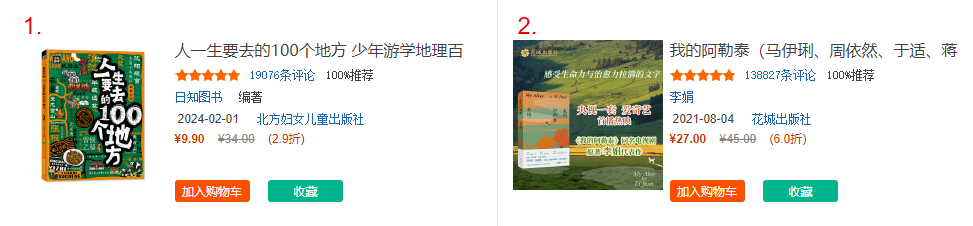

# 爬取当当图书畅销榜

## 概要

### 业务需求

​	　爬取[当当图书畅销榜](http://bang.dangdang.com/books/bestsellers/)的书名、作者、价格、出版日期以及推荐等信息到Excel表格中。



### 总体设计

（1）开发思路

​	　该网页是由后端直接生成并返回给浏览器显示的，所以，只能通过解析HTML的方式来获取数据，基本思路如下：

```
① 获取网页源代码
② 解析数据 提取想要的内容，如 书名、作者、价格、
③ 保存数据到本地，格式为cvs表格数据
④ 进行多页/翻页爬取
```

（2）关键HTML代码

```html
<ul class="bang_list clearfix bang_list_mode">
  <li>
    <div class="list_num red">序号</div>    
    <div class="pic">图片</div> 
    <div class="name">
        <a href="http://xx" title="月亮与六便士">月亮与六便士</a>
    </div>    
    <div class="star">
        <a>1589523条评论</a>
        <span class="tuijian">100%推荐</span>
    </div>    
    <div class="publisher_info">[英] 
        <a title="[英] 毛姆 著" >毛姆</a> 
    </div>    
    <div class="publisher_info">
        <span>2017-01-10</span>
        <a>浙江文艺出版社</a>
    </div>
    <div class="price">        
        <span class="price_n">39.80</span>
        <span class="price_r">39.80</span>
        <span class="price_n">3.99</span>
    </div>
  </li> 
</ul>  
```


## 开发

### 准备

（1）开发环境

```
解释器：Python 3.11.4
IDE版本：PyCharm 2023.1.3 (Professional Edition)
```

（2）安装第三方模块

```shell
# 用于发送HTTP请求
pip install requests
# 数据解析
pip install parsel
```


### 编码

```python
import datetime
import time
import requests
import parsel
import csv

# 设置导出结果文件名
data_str = datetime.datetime.now().strftime("%Y%m%d%H%M%S")
cvs_file_name = f"当当图书畅销榜_{data_str}.csv"

# 中文需要设置成utf-8-sig格式,否则可能乱码
f = open(cvs_file_name, mode='a', encoding='utf-8-sig', newline='')
# fieldnames 表头
csv_writer = csv.DictWriter(f, fieldnames=[
    '书名', '作者', '原价', '售价', '电子书价格', 
    '出版日期', '出版社', '推荐', '评价', '链接'
])
# 写入表头
csv_writer.writeheader()

# 爬取第1页到25页数据
for page in range(1, 26):
    print(f"正在爬取第{page}页数据...")
    time.sleep(1)
    url = f"http://bang.dangdang.com/books/bestsellers/1-{page}"
    # 发送请求时 需携带请求头参数
    # 请求头用于把Python代码伪装成浏览器对服务器发送请求,否则容易被反爬程序拦截
    headers = {
        # User-Agent 可以通过F12获取
        "User-Agent": "Mozilla/5.0 (Windows NT 10.0; Win64; x64) "
                      "AppleWebKit/537.36 (KHTML, like Gecko) "
                      "Chrome/125.0.0.0 Safari/537.36"
    }

    # response 表示请求返回对象, 状态码200 表示请求成功
    response = requests.get(url=url, headers=headers)
    if response.status_code != 200:
        print(f"爬取第{page}页数据时失败:", response)
        continue

    # 解析返回数据
    # response.text 获取网页源代码(获取响应体的文本数据)
    selector = parsel.Selector(response.text)
    # 提取具有.bang_list样式的ul标签下所有的li标签
    lis = selector.css('ul.bang_list li')
    # 获取所有书名，返回列表 取单条属性时建议
    # lis = selector.css('ul.bang_list li .name a::attr(title)').getall()
    for li in lis:
        # getall() 获取所有标签的数据内容

        # 获取li中具有.name样式的a标签的title属性
        # get() 获取标签数据内容 | attr() 属性选择器
        book_name = li.css('.name a::attr(title)').get()  # 书名
        book_href = li.css('.name a::attr(href)').get()  # 链接

        # ::text 获取标签的文本数据
        recommend = li.css('.tuijian::text').get()  # 推荐
        star = li.css('.star a::text').get()  # 评价
        price_r = li.css('.price .price_r::text').get()  # 原价
        price_n = li.css('.price .price_n::text').get()  # 售价
        price_e = li.css('.price_e span::text').get()  # 电子书价格

        # div:nth-child(5)：选择li子标签中第5个div标签
        # a:nth-child(1) 选择div标签第1个a标签
        author = li.css('div:nth-child(5) a:nth-child(1)::attr(title)').get()
        public_date = li.css('div:nth-child(6) span::text').get()  # 出版日期
        publisher = li.css('div:nth-child(6) a::text').get()  # 出版社

        # 映射Excel标题与对应数据
        dit = {
            '书名': book_name,
            '作者': author,
            '原价': price_r,
            '售价': price_n,
            '电子书价格': price_e,
            '出版日期': public_date,
            '出版社': publisher,
            '推荐': recommend,
            '评价': star,
            '链接': book_href,
        }
        csv_writer.writerow(dit)
# 关闭文件
f.close()
print("爬取数据完毕！")
```
